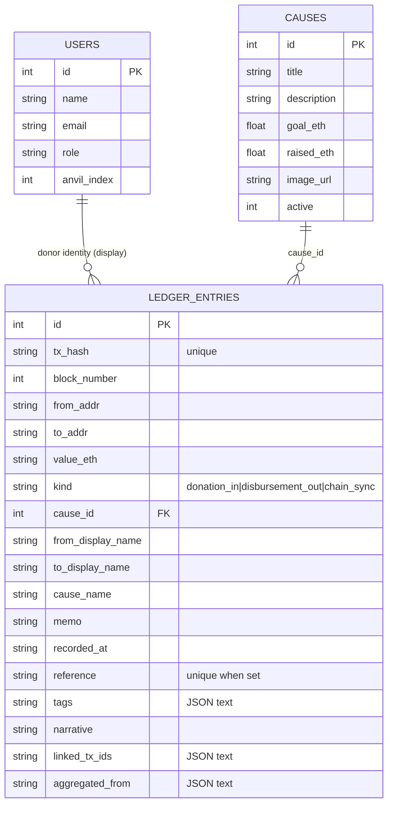
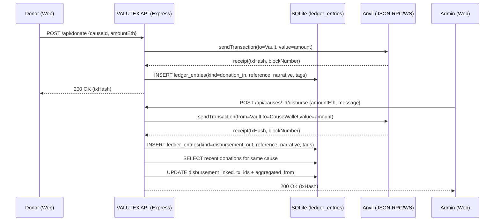

## Enhanced Ledger Architecture: Searchable, Traceable, and Human-Centric Transparency

The original VALUTEX ledger was designed to prove a simple but critical claim: **donations in** and **disbursements out** are visible, auditable, and tied to causes. In the Interim Thesis context (ITEC631), this provided an initial transparency baseline—transactions existed, could be inspected, and could be reconciled with the platform’s Web2 cause registry. However, a baseline ledger has an immediate usability limitation: raw transaction rows are easy to store but difficult to interpret. Donors, administrators, and hospitals often need answers like:

- “Which donations funded this disbursement?”
- “What proportion of a cause’s donations have been utilized?”
- “Can I search for a particular reference, tag, or story narrative without knowing a hash?”

Ledger v2 addresses these questions by extending the database schema, introducing a **LedgerService** layer that generates and enriches narratives, and adding searchable and filterable APIs that can be presented in the UI as an accountability grid and transaction detail modal. This section describes the improved architecture and argues that the changes strengthen two thesis-aligned principles:

- **Stewardship**: donors and administrators can clearly trace allocation decisions and verify outcomes.
- **Subsidiarity**: hospitals/beneficiaries gain visibility into how funds assigned to their cause are aggregated, disbursed, and reported in human terms.

### Schema evolution (from “rows” to “explainable entries”)

Ledger v2 extends `ledger_entries` to support **traceability**, **searchability**, and **human-centered descriptions** while remaining backward compatible with the original donation/disbursement flows.

Key enhancements:

- **`reference` (unique)**: a human-readable identifier (e.g., `DON-ABC123...`, `DIS-...`) that enables non-technical referencing in reports and UI.
- **`tags` (JSON text)**: classification labels such as `"donation"`, `"disbursement"`, `"urgent"`, or stakeholder-defined tags for reporting.
- **`narrative` (TEXT)**: a generated story-like sentence that converts ledger rows into human-readable explanations.
- **`linked_tx_ids` (JSON text)**: links a disbursement to the donation entries that “cover” it (a deterministic “most recent donations first” method).
- **`aggregated_from` (JSON text)**: stores a donor summary for the disbursement (initials + amount) to support privacy-aware transparency.

These additions support the same hybrid model: the platform maintains Web2 state (users, causes) while anchoring financial movements to Web3-style transaction proof.

### Updated ER diagram

### Search + filters: from “scroll” to “audit queries”

Ledger v2 introduces **full-text search** (FTS5) and filterable endpoints to support fast retrieval by meaning rather than by position in a list. The platform can now answer queries such as:

- “Show all disbursements for the Hospital cause in April.”
- “Find entries tagged `urgent` or referenced in a meeting note.”
- “Search narratives for ‘disbursed’ and cross-check the vault balances.”

Technically, this is achieved by storing a searchable projection of ledger attributes in an FTS table (`ledger_entries_fts`) and maintaining it with triggers on insert/update/delete. This approach avoids denormalizing the primary ledger table and keeps the ledger as the single source of truth.

### Narrative generation as an explicit service

Instead of treating text as an optional UI label, Ledger v2 treats narrative generation as part of the accounting pipeline. Whenever a donation or disbursement is inserted:

1. A stable `reference` is generated.
2. A `narrative` is generated using template strings.
3. `tags` are assigned to support filtering.
4. If the entry is a disbursement with a cause, it is linked to recent donations for that cause and stores aggregated donor initials.

The narrative format is intentionally predictable and audit-friendly:

- Donation:
  - “Account Name donated X ETH to VAULTEX (Cause: …).”
- Disbursement:
  - “VAULTEX disbursed Y ETH to Hospital Name (Cause Utilization: A/B).”

Predictability matters for technical writing and reporting: narratives can be copied into thesis artefacts and stakeholder summaries without losing the underlying traceability.

### Sequence: donation → disbursement → aggregation

The aggregation step is critical for “hybrid transparency”: it provides an accountable story of where disbursed funds conceptually came from, without exposing donor identities unnecessarily.

### Privacy vs transparency trade-offs

A donation platform must balance two valid stakeholder needs:

- **Transparency**: auditors and donors want to verify how funds move, especially for disbursements.
- **Privacy**: donors may not want their full identity exposed to other donors or third parties browsing a public ledger.

Ledger v2 enforces privacy through a conservative display rule:

- The API returns donor names for ledger entries as **initials** by default.
- The **current logged-in user** can see their own full name in linked donor lists (self-disclosure), but other donors remain masked.

This provides “minimum necessary disclosure”: disbursements are explainable and attributable in aggregate, while individual identities are protected unless the user is viewing their own participation.

In the thesis framing, this supports **stewardship** by keeping disbursement logic auditable and supports **subsidiarity** by enabling hospitals to see disbursement composition (as aggregated donor summaries) without requiring donor identity access.

### Why this improves stewardship and subsidiarity

**Stewardship** improves because the ledger becomes not just a record but a *reconciliation tool*:

- References make entries discussable in governance meetings.
- Utilization metrics convert raw events into measurable outcomes per cause.
- Linked donation aggregation provides a defensible explanation for why a disbursement is legitimate.
- On-chain verification compares vault balances at the relevant block boundaries.

**Subsidiarity** improves because beneficiary institutions (hospitals) can understand and communicate how funds were assigned and utilized without requiring deep blockchain expertise:

- “This disbursement was funded by recent donors (initials only)”
- “Utilization is X% of donated funds”
- “Remaining funds in VALUTEX for this cause is Y”

The platform thus moves toward a practical governance model: donors retain oversight, administrators retain execution capability, and hospitals gain visibility that supports planning and reporting at the local level.

