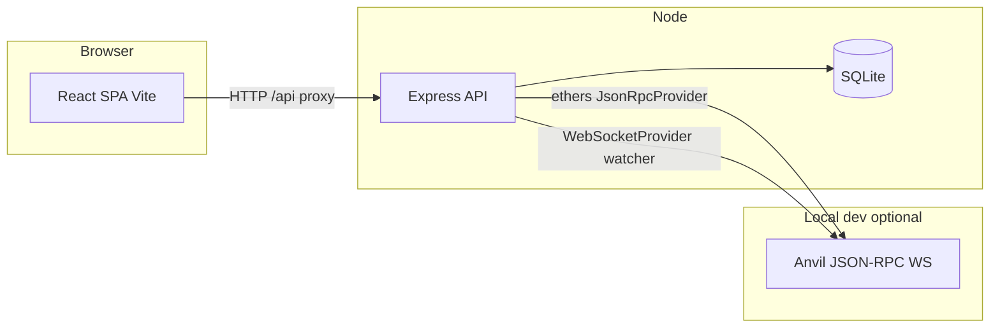
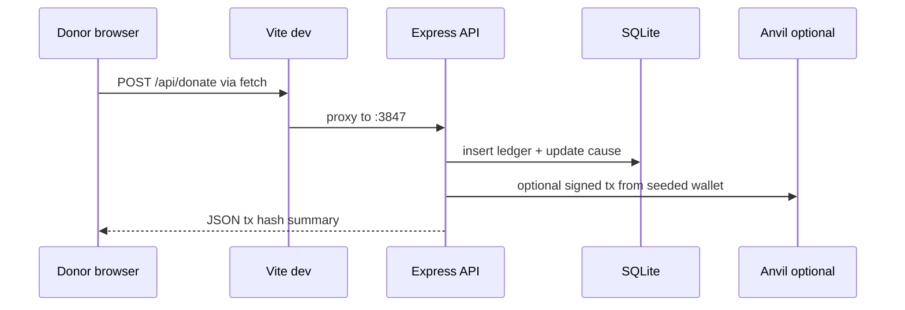
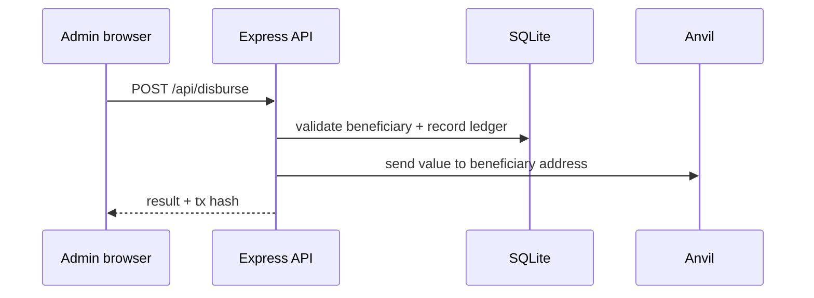

# Vaultex — architecture

## System context

- **Frontend** (`frontend/`): calls relative `/api/...`; Vite dev server proxies to backend **3847**.
- **Backend** (`backend/server/`): HTTP API, cookie sessions, seeding, optional chain watcher inserting `ledger_entries`.

---

## Donate flow (simplified)

*Exact steps depend on `app.ts` implementation; this matches the mental model: persist intent + chain interaction when RPC works.*

---

## Admin disburse flow (simplified)

---

## Chain watcher (optional)

When `ANVIL_WS_URL` / RPC is reachable, the watcher subscribes to new blocks and inserts matching transfers as `chain_sync` rows (see `backend/server/watcher.ts`). If Anvil is down, the API may log a warning and continue without crashing (behavior may evolve—check logs).

---

## Key files

| Area | Path |
|------|------|
| Routes + handlers | `backend/server/app.ts` |
| DB schema / open | `backend/server/db.ts` |
| Seed users / causes | `backend/server/seed.ts` |
| Masking + labels | `backend/server/resolve.ts` |
| Anvil key derivation | `backend/server/anvil.ts` |
| Entry + watcher start | `backend/server/index.ts` |
| SPA routes | `frontend/src/App.tsx` |
| API client | `frontend/src/lib/api.ts` |
