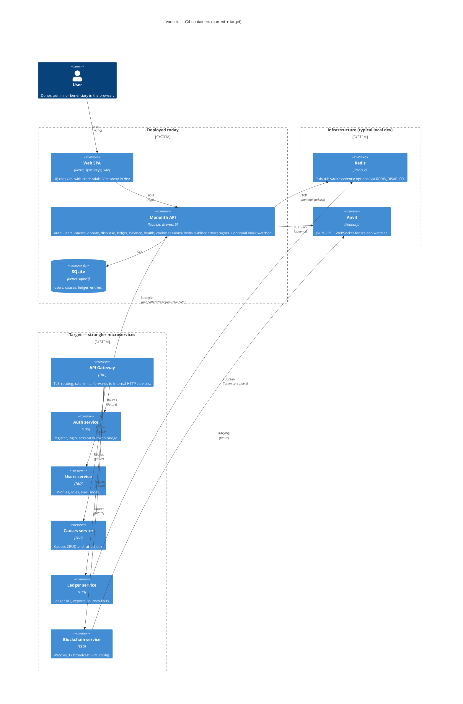
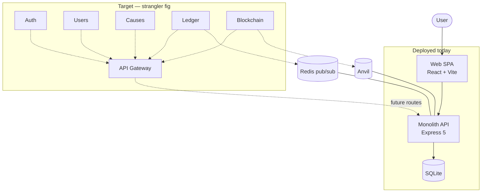
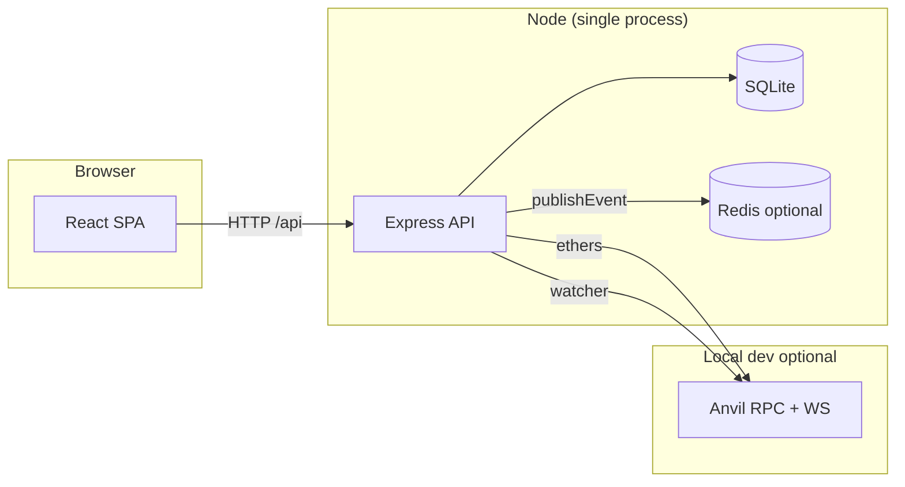
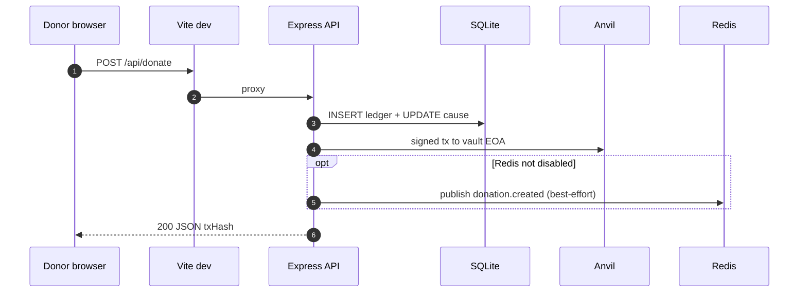
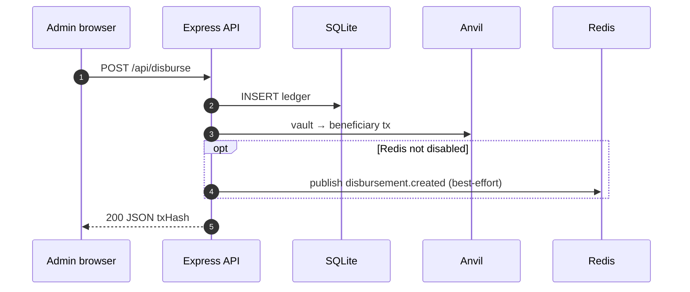
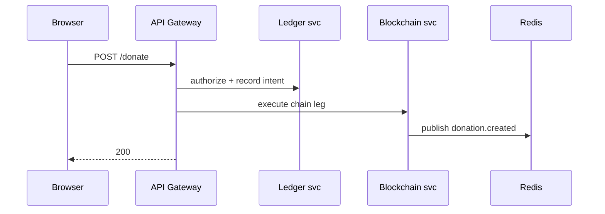

# Vaultex — architecture

This document describes **what runs today** (monolith + optional infra) and the **target decomposition** from the capstone roadmap. See [ADR/](ADR/) for decisions and [openapi/](openapi/) for API sketches.

---

## C4 Container — current deployment + target services

*Implemented paths are solid; the “future” boundary is the capstone target (not deployed as separate processes yet).*

**Reading the diagram**

| Element | Today | Target |
|---------|--------|--------|
| **Web SPA** | Same; may later call gateway URL instead of monolith. | Unchanged UX; base URL may change. |
| **Monolith API** | Hosts all `/api` routes and bounded-context logic in `app.ts` + modules. | Shrinks as routes move behind **API Gateway**; eventual retirement or “BFF” role. |
| **SQLite** | Single file; all tables. | Split per service or keep read models — ADR TBD. |
| **Redis** | In-process **publish** after donate/disburse. | **Bus** between services + workers (see `REDIS_EVENTS.md`). |
| **Anvil** | Used by monolith for txs + watcher. | Prefer **Blockchain service** owning RPC + watcher. |
| **Gateway + 5 services** | Not in repo yet; tracker items M-001…M-007. | Strangler: extract **read-heavy** or **stable** slices first (often ledger read + causes). |

If your Mermaid renderer does not support **C4** syntax, use the fallback below (equivalent intent).

### Fallback: flowchart (universal Mermaid)

---

## System context (current)

- **Frontend** (`frontend/`): `fetch('/api/...')`; Vite proxies to **3847** in dev.
- **Backend** (`backend/server/`): one HTTP server; cookie sessions; optional Redis; optional chain watcher.

---

## Donate flow (current)

*If Anvil is unreachable, donate fails at chain step. If Redis is down or disabled, publish is skipped or best-effort (logged); HTTP response still returns after successful DB + chain.*

---

## Admin disburse flow (current)

---

## Target donate flow (conceptual — after gateway + services)

*Exact boundaries TBD; use ADR-0001 strangler ordering.*

---

## Chain watcher (optional)

When RPC/WS to Anvil is up, `watcher.ts` ingests blocks and writes `chain_sync` rows. See `backend/server/watcher.ts`.

---

## Key files (current)

| Area | Path |
|------|------|
| Routes + handlers | `backend/server/app.ts` |
| Network + RPC resolution | `backend/server/config.ts` |
| DB schema | `backend/server/db.ts` |
| Seed | `backend/server/seed.ts` |
| Masking | `backend/server/resolve.ts` |
| Anvil keys | `backend/server/anvil.ts` |
| Entry + shutdown | `backend/server/index.ts` |
| Readiness (`GET /ready`) | `backend/server/health.ts` |
| Redis | `backend/server/lib/redis.ts` |
| SPA routes | `frontend/src/App.tsx` |
| API client | `frontend/src/lib/api.ts` |
| Foundry | `foundry.toml`, `remappings.txt`, `blockchain/src/` |

---

## Further reading

| Doc | Topic |
|-----|--------|
| [ADR/0001-microservices-strangler-fig.md](ADR/0001-microservices-strangler-fig.md) | Strangler evolution |
| [ADR/0002-session-strategy.md](ADR/0002-session-strategy.md) | Cookie vs JWT at gateway |
| [openapi/](openapi/) | Stub OpenAPI specs |
| [REDIS_EVENTS.md](REDIS_EVENTS.md) | Event envelope |
