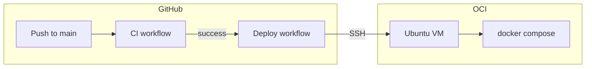

# Deploy Vaultex to Oracle Cloud (Ubuntu)

**Production default (CI/CD):** **[DEPLOY-NATIVE.md](./DEPLOY-NATIVE.md)** — nginx + Node + Anvil via systemd (no Docker, fits Always Free).

This guide covers the **Docker Compose** path (optional). Set GitHub secret `DEPLOY_DOCKER=true` to use it instead of native deploy.

## Architecture



## 1. Oracle Cloud VM

1. Create a **Compute** instance: **Ubuntu 22.04 or 24.04**, shape with at least **2 GB RAM** (Anvil + Node builds need memory).
2. Download the **SSH private key** (.pem) when creating the instance (or use your own key pair).
3. Note the instance **public IP**.

### Network (required)

In the VCN **Security List** (or NSG on the instance subnet), add **Ingress** rules:

| Port | Protocol | Source        | Purpose        |
|------|----------|---------------|----------------|
| 22   | TCP      | Your IP       | SSH / deploy   |
| 8080 | TCP      | 0.0.0.0/0     | Vaultex web UI |

(For production, restrict 8080 to known IPs or put **nginx + TLS** on 443 in front.)

## 2. One-time server setup

SSH in as `ubuntu` (or your chosen user):

```bash
ssh -i your-key.pem ubuntu@YOUR_PUBLIC_IP
```

Run bootstrap (installs Docker, clones repo, creates `.env`):

```bash
curl -fsSL https://raw.githubusercontent.com/RbbSukhRkhe1/NewRepo/main/scripts/server-bootstrap.sh -o bootstrap.sh
chmod +x bootstrap.sh
./bootstrap.sh
```

If Docker was just installed, **log out and SSH back in** so your user is in the `docker` group, then:

```bash
cd /opt/vaultex
./scripts/deploy.sh
```

Open `http://YOUR_PUBLIC_IP:8080` — demo login password: `demo123` (see root README).

## 3. GitHub Actions secrets

In the repo: **Settings → Secrets and variables → Actions → New repository secret**

| Secret           | Example / notes                                      |
|------------------|------------------------------------------------------|
| `DEPLOY_HOST`    | `123.45.67.89` or DNS name                           |
| `DEPLOY_USER`    | `ubuntu`                                             |
| `DEPLOY_SSH_KEY` | Full private key PEM (contents of `.pem` file)       |
| `DEPLOY_PATH`    | Optional; default `/opt/vaultex`                     |
| `DEPLOY_SSH_PORT`| Optional; default `22`                               |

**SSH key for Actions:** either use the same `.pem` from instance creation, or generate a dedicated deploy key:

```bash
# On your laptop
ssh-keygen -t ed25519 -f vaultex-deploy -N ""
# On server (as ubuntu):
cat vaultex-deploy.pub >> ~/.ssh/authorized_keys
# In GitHub: DEPLOY_SSH_KEY = contents of vaultex-deploy (private)
```

## 4. How deploy runs

- **Automatic:** After **CI** succeeds on a **push to `main`**, the **Deploy** workflow SSHs to the server, `git pull`, and runs `scripts/deploy.sh` (`docker compose up -d --build`).
- **Manual:** **Actions → Deploy → Run workflow**.

## 5. Environment on the server

Edit `/opt/vaultex/.env` for production:

```bash
WEB_HOST_PORT=8080
SESSION_SECRET=...   # strong random string (bootstrap sets one)
# READY_SKIP_RPC=1   # only if you run API without Anvil
```

Do not commit `.env`.

## 6. Troubleshooting

| Issue | Fix |
|-------|-----|
| Deploy workflow: "Missing git repo" | Run `server-bootstrap.sh` on the VM |
| Connection timed out on SSH | Check OCI security list, instance public IP, `ufw` |
| Browser cannot reach :8080 | Open TCP 8080 in OCI; `sudo ufw allow 8080` |
| Backend unhealthy | `docker compose logs backend` — wait for Anvil/Redis healthy |
| Permission denied (docker) | `sudo usermod -aG docker $USER` and re-login |

## 7. Optional hardening

- Use **Caddy** or **nginx** on the host with Let's Encrypt on port 443, proxy to `127.0.0.1:8080`.
- Restrict SSH to your IP only in OCI.
- Rotate `SESSION_SECRET` and redeploy.
